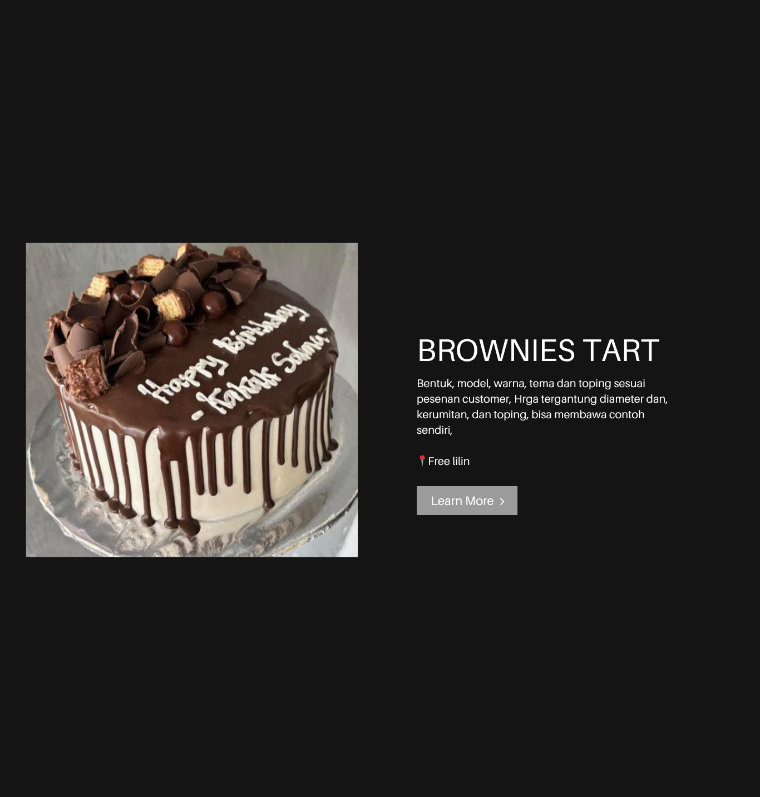

<!DOCTYPE html>
<html lang="id">
<head>
  <meta charset="UTF-8" />
  <meta name="viewport" content="width=device-width, initial-scale=1.0"/>
  <title>Brownies Tart</title>
  
</head>
<body>
  

    

      
    

    

      <h1>BROWNIES TART</h1>
      
Bentuk, model, warna, tema dan toping sesuai pesenan customer. Harga tergantung diameter, kerumitan, dan toping. Bisa membawa contoh sendiri.

      
📍 Free lilin

      <a class="btn" href="#">Learn More ›</a>
    

  

</body>
</html>
